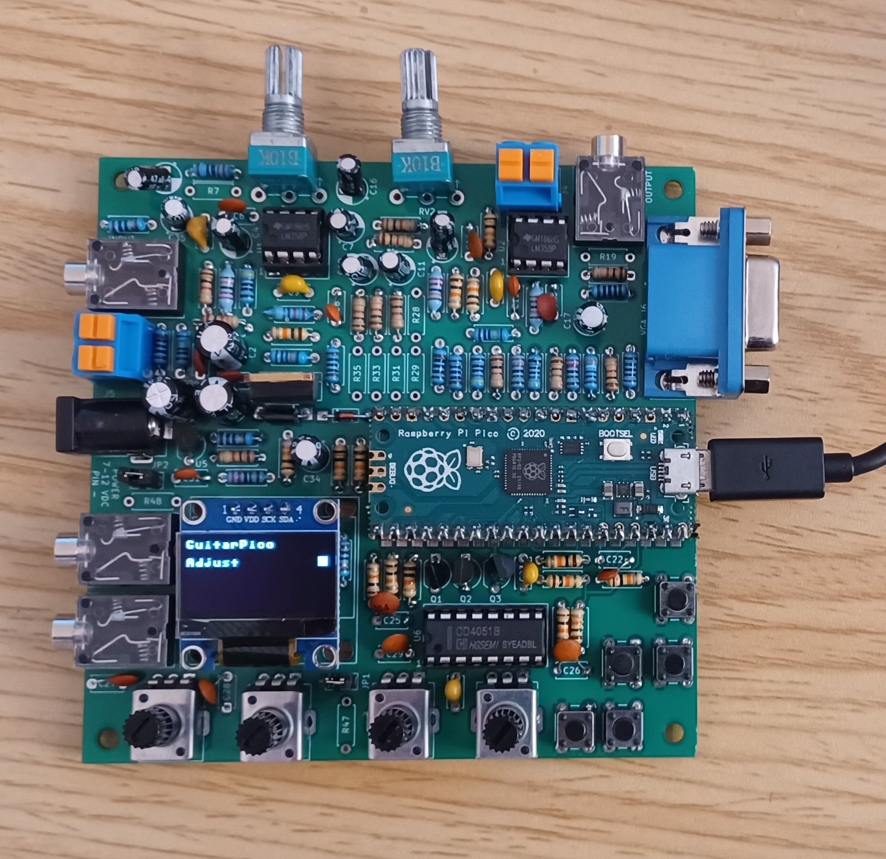

# Guitar Pico

This is a guitar effects processor based on the Raspberry Pi Pico.  A video of some of the effects is at

https://www.youtube.com/watch?v=15d9mEu2koQ

It includes the following effects:

1.  Noise Gate
2.  Delay 
3.  Room (set up specific echoes at particular delays)
4.  Combine (mix together the signals from several effects)
5.  2nd order Bandpass filter
6.  2nd order Lowpass filter
7.  2nd order Highpass filter
8.  2nd order Allpass filter
9.  Tremolo (amplitude modulated by a low frequency oscillator)
10.  Vibrato (pitch modulated by a low frequency oscillator)
11.  Wah (bandpass filter with center frequency controlled by an external control like a pedal)
12.  AutoWah (bandpass filter with center frequency modulated by a low frequency oscillator)
13.  Envelope (bandpass filter with center frequency modulated by signal amplitude)
14.  Distortion (amplification resulting in saturation of the signal)
15.  Overdrive (selectable threshold for low signal / high signal amplitude gain)
16.  Compressor (amplifies weak signals to equal out overall amplitude of signal)
17.  Ring (ring modulator using low frequency oscillator)
18.  Flanger (pitch modulated by a low frequency oscillator, with feedback and combined with unmodulated signal)
19.   Chorus (pitch modulated by a low frequency oscillator, no feedback and combined with unmodulated signal)
20.  Phaser (signal run through multiple stages of all pass filters, combined with unmodulated signal)
21.  Backwards (plays the last samples backwards for weird swooping effect)
22.  PitchShift (allows shifting the pitch by variable amounts, useful for harmony-like effect)
23.  Whammy (pitch shift based on external control like a pedal)
24.  Octave (rectification and amplification of the signal with extreme distortion)
25.  Sinusoidal Oscillator (built in test signal source)

The effects may be cascaded, to up to 16 in a sequence.  The settings of a particular sequence of effects may be saved in flash memory.  

There is a stomp pedal which may be used to one of four saved settings, based on which of the four buttons is stomped on.  It does not require power to operate.

The pedal has four potentiometers that may be assigned to control various aspects of effects operation.  There are also two external inputs.  These can be used with the stomp pedal, or with an expression pedal to control aspects of the effects.

There is also a feature to determine the frequency and note being played, to help with tuning a guitar.  Also, if plugged into USB, notes played on the guitar are sent as MIDI events to the PC to turn the guitar into a MIDI instruments.  However, this feature is imperfect (but this useful for tuning).

As well as a MIDI device, the guitar pedal appears as a COM port.  The effect settings may be retrieved from the pedal or programmed into the pedal through this interface using text commands at a prompt.  Type "HELP" for a list of the commands.

There is also a VGA port that will be used to implement video effects.

The hardware is licensed under CC-BY-SA 4.0 and software under the zlib license, both open source licenses.

